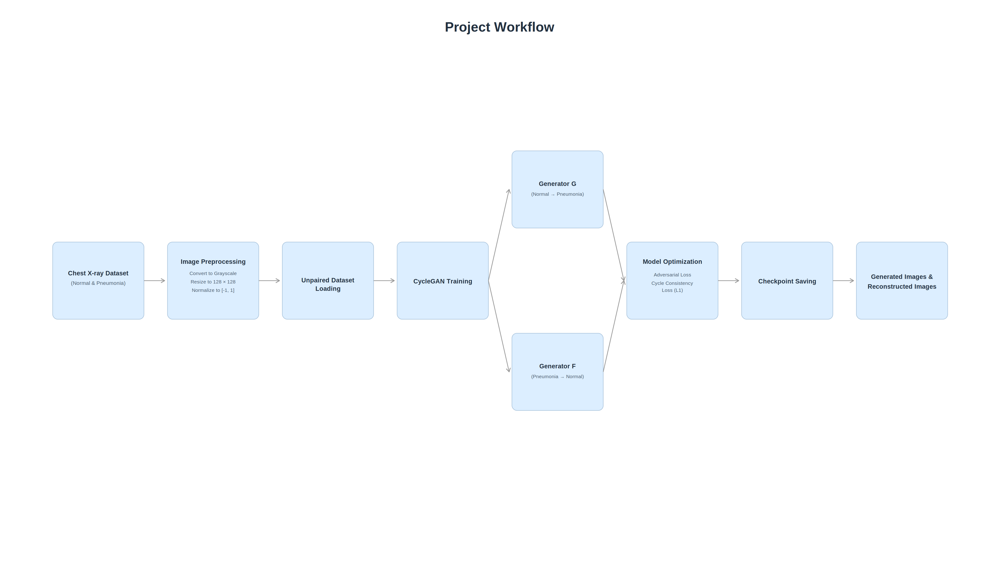
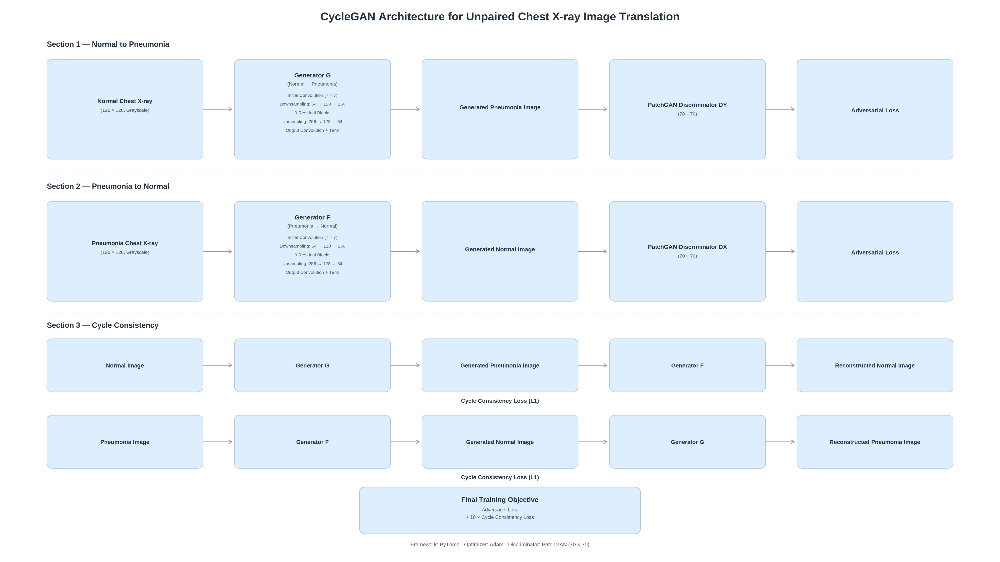

# CycleGAN for Chest X-ray Image Translation

## Overview

This project implements a **Cycle-Consistent Generative Adversarial Network (CycleGAN)** for unpaired image-to-image translation between **Normal** and **Pneumonia** chest X-ray images. Unlike supervised image translation methods, CycleGAN learns mappings between two image domains without requiring paired training data by leveraging adversarial learning and cycle consistency.

The project includes custom implementations of the **Generator**, **PatchGAN Discriminator**, data preprocessing, model training, checkpoint generation, qualitative evaluation, and visualization of translated and reconstructed images.

---

## Project Overview

| Attribute | Details |
|-----------|---------|
| **Project Type** | Medical Image Translation |
| **Task** | Unpaired Image-to-Image Translation |
| **Architecture** | CycleGAN |
| **Framework** | PyTorch |
| **Dataset** | Chest X-ray Pneumonia Dataset |
| **Image Size** | 128 × 128 |
| **Input Format** | Grayscale Images |
| **Domains** | Normal ↔ Pneumonia |

---

## Project Workflow

<p align="center">

</p>

---

## Model Architecture

<p align="center">

</p>

---

## Key Features

- Custom CycleGAN implementation using PyTorch
- Residual Block based Generator architecture
- PatchGAN Discriminator
- Cycle Consistency Learning
- Least Squares GAN (LSGAN) Loss
- Automatic checkpoint generation
- Image translation and reconstruction visualization
- Modular project organization
- GPU-compatible training pipeline

---

## Repository Structure

```text
CycleGAN-Chest-Xray-Image-Translation/
│
├── images/
│   ├── architecture.png
│   ├── workflow.png
│   └── results.png
│
├── models/
│   ├── generator.py
│   ├── discriminator.py
│   └── residual_block.py
│
├── notebooks/
│   └── CycleGAN_Training.ipynb
│
├── utils/
│   ├── dataset.py
│   ├── losses.py
│   └── visualize.py
│
├── config.py
├── train.py
├── requirements.txt
├── LICENSE
└── README.md
```

---

## Dataset

The model is trained using the **Chest X-ray Pneumonia Dataset**, which consists of two unpaired image domains:

- Normal Chest X-rays
- Pneumonia Chest X-rays

During preprocessing, all images are:

- Converted to grayscale
- Resized to **128 × 128**
- Normalized to the range **[-1, 1]**
- Loaded using PyTorch `ImageFolder` and `DataLoader`

---

## Training Pipeline

1. Load Normal and Pneumonia image datasets
2. Apply preprocessing and normalization
3. Train Generators and PatchGAN Discriminators
4. Compute Adversarial and Cycle Consistency losses
5. Update model parameters using the Adam optimizer
6. Save model checkpoints periodically
7. Generate translated and reconstructed images for qualitative evaluation

---

## Results

The figure below shows qualitative results obtained during training.

Rows represent:

- Original Images
- Generated Images
- Reconstructed Images

<p align="center">

</p>

The generated images demonstrate successful domain translation while preserving the underlying anatomical structures through cycle consistency.

---

## Technologies Used

- Python
- PyTorch
- TorchVision
- NumPy
- Matplotlib
- PIL
- Jupyter Notebook
- Kaggle

---

## Installation

Clone the repository

```bash
git clone https://github.com/yourusername/CycleGAN-Chest-Xray-Image-Translation.git
```

Install dependencies

```bash
pip install -r requirements.txt
```

Update the dataset path in `config.py`

```python
DATASET_PATH = "/path/to/chest_xray/train"
```

Run the training script

```bash
python train.py
```

---

## Notes

- The original Jupyter Notebook used during experimentation is available in the `notebooks/` directory.
- Model checkpoints are generated automatically during training.
- The Chest X-ray dataset is not included in this repository due to size limitations.

---

## Future Enhancements

- Identity Loss implementation
- Mixed Precision Training
- Learning Rate Scheduling
- Quantitative evaluation using SSIM and PSNR
- Standalone inference script
- Higher resolution image translation

---

## Authors

**Vibha I S**

B.E. Electronics and Communication Engineering

---

## License

This project is licensed under the MIT License.
